# BC Garage Doors - Website Redesign

Modern redesign of [bcgaragedoors.ca](https://bcgaragedoors.ca) using Apple Liquid Glass aesthetic.

**Live:** [nulljosh.github.io/bcgd](https://nulljosh.github.io/bcgd)

## About the Business

- **Best Choice Garage Door Services Inc.** (trade name: BC Garage Doors)
- Family-owned, three generations — founded by Brian Trommel
- 30+ years experience, repair-only (no new door installs)
- LiftMaster specialists
- 4.9/5 stars (128 reviews)
- 24/7 emergency service
- Serving all of Lower Mainland BC (Vancouver to Abbotsford)
- Phone: (604) 240-0180

## Design

- Apple Liquid Glass: frosted glass panels, `backdrop-filter: blur(20px)`, translucent backgrounds
- `-apple-system` font stack, `#f5f5f7` background, `#0071e3` CTAs
- Mobile-responsive with hamburger nav
- Scroll-reveal animations via IntersectionObserver
- Single-page with all content: hero, services, about, process, reviews, tips, areas, FAQ, contact

## Site Map

```mermaid
graph TD
    A[BC Garage Doors] --> B[Hero]
    A --> C[Services]
    A --> D[About]
    A --> E[Reviews]
    A --> F[Contact]

    C --> C1[Springs]
    C --> C2[Cables]
    C --> C3[Hinges]
    C --> C4[Emergency 24/7]
    C --> C5[Keypads]
    C --> C6[Clickers/Remotes]
    C --> C7[Panels]
    C --> C8[Weather Strips]
    C --> C9[Rollers]
    C --> C10[Maintenance]
    C --> C11[General Repair]

    A --> G[Safety Tips]
    G --> G1[Misaligned Door]
    G --> G2[Broken Spring]
    G --> G3[Weight Balance]
    G --> G4[Stripped Gear]

    A --> H[FAQ]
    A --> I[Service Areas]
    I --> I1[Vancouver]
    I --> I2[Burnaby]
    I --> I3[Surrey]
    I --> I4[Langley]
    I --> I5[+ 14 more cities]

    style A fill:#0071e3,color:#fff
    style C fill:#34c759,color:#fff
    style D fill:#ff9500,color:#fff
    style E fill:#af52de,color:#fff
    style F fill:#ff3b30,color:#fff
```

## Content

- 11 services with detailed descriptions and warning signs
- 6 customer reviews with full quotes
- 4 safety tips for homeowners
- 7 FAQ items with expandable answers
- 18 service areas across Lower Mainland
- Original images from live site (logo, truck, team, portraits)
