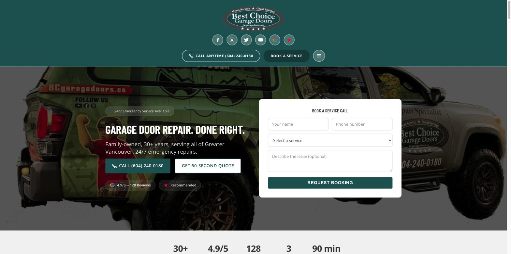
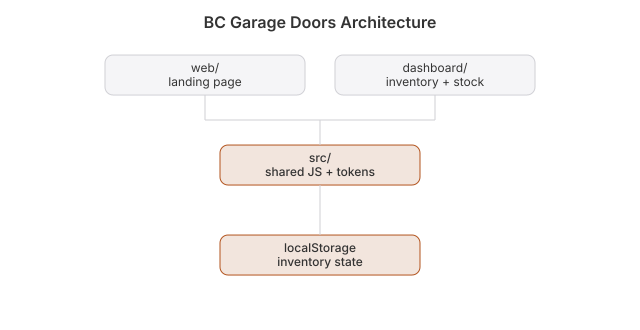

# BC Garage Doors

 

A website and a stock dashboard for Best Choice Garage Doors (bcgaragedoors.ca). One brings customers in. The other tells the shop what's on the shelf.

## Screenshots

## Projects

| Directory | Description | URL |
|-----------|-------------|-----|
| `web/` | Conversion landing page | [bcgd.heyitsmejosh.com](https://bcgd.heyitsmejosh.com) |
| `dashboard/` | Inventory and stock tracker | [bcgd-dashboard.heyitsmejosh.com](https://bcgd-dashboard.heyitsmejosh.com) |

## License

MIT 2026, Joshua Trommel

## Whitepaper

[Technical whitepaper](WHITEPAPER.md)

## Architecture

